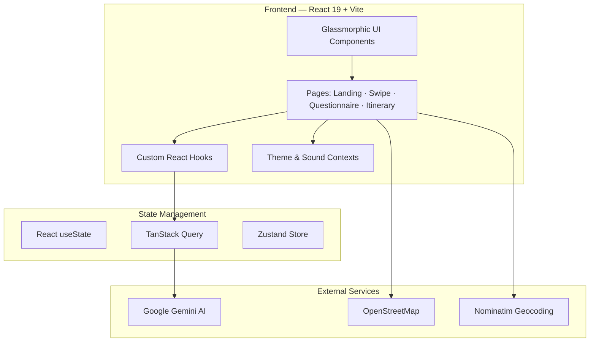

<div align="center">


# Tratlus

**AI-powered travel itinerary planner — discover your travel personality through swipes, then get a personalized day-by-day itinerary.**

[](https://react.dev/)
[](https://www.typescriptlang.org/)
[](https://ai.google.dev/)
[](https://tailwindcss.com/)
[](https://web.dev/progressive-web-apps/)

[Portfolio](https://sahilkamal.dev) · [LinkedIn](https://linkedin.com/in/sahilkamalny) · [Contact](mailto:sahilkamal.dev@gmail.com)

[Architecture](ARCHITECTURE.md) · [Features](FEATURES.md) · [Tech Stack](TECH_STACK.md)

</div>

---

## Overview

Tratlus is a mobile-first travel planning application that infers user preferences through a Tinder-style swipe interface across 50+ curated destinations, then synthesizes those signals with a structured questionnaire to generate a detailed, day-by-day itinerary via the Google Gemini API. Users can edit, reorder, and export their itinerary, with activity locations rendered on an embedded OpenStreetMap.

---

## Screenshots

<div align="center">

| Landing Page | Swipe Deck |
|:---:|:---:|
|  | *Coming soon* |

| Questionnaire | Generated Itinerary |
|:---:|:---:|
| *Coming soon* | *Coming soon* |

</div>

---

## Features

**Swipe-Based Preference Discovery**
- Tinder-style swipe gestures (like / dislike / skip) across 50+ curated destination cards
- Intelligent tag-weighting derived from swipe patterns with real-time calibration feedback
- Quick-skip option to proceed directly to the questionnaire

**Multi-Step Questionnaire**
- Dietary preferences and allergy tracking
- Transportation priorities (speed, comfort, cost, eco-friendliness)
- Accommodation preferences with star ratings and amenity filters
- Budget sliders with custom numeric input; trip duration and date selection

**AI Itinerary Generation**
- Google Gemini API integration with real-time streaming responses
- Day-by-day breakdown with timed activities and per-activity cost estimates
- Smart recommendations derived from combined swipe and questionnaire signals

**Itinerary Management**
- Drag-and-drop activity reordering
- OpenStreetMap + Nominatim integration for location visualization
- Activity deletion with confirmation; custom activity creation
- One-click AI re-optimization of the full itinerary

**Export & Share**
- PDF export via jsPDF with formatted layout
- Email and calendar integration for sharing and scheduling

**UI / UX**
- Glassmorphic design system with blur effects and CSS variables
- Dark / light mode with system preference detection
- Sound effects with per-user volume controls
- Mobile-first responsive layout; PWA manifest for home-screen installation

---

## Architecture



**Key decisions**

| Concern | Choice | Rationale |
|---|---|---|
| Frontend | React 19 + TypeScript | Concurrent rendering, type safety, modern hooks |
| Build | Vite (Rolldown) | Sub-second HMR, optimized production output |
| Styling | Tailwind CSS 4 | Utility-first with dark mode and CSS variable integration |
| Routing | TanStack Router | Type-safe, file-based routing |
| Data fetching | TanStack Query | Caching, mutation lifecycle, streaming AI responses |
| UI primitives | Radix UI + shadcn/ui | Accessible, unstyled, composable components |
| AI | Google Gemini API | Fast responses, structured JSON output |
| Maps | OpenStreetMap + Nominatim | Open-source, zero-cost mapping and geocoding |

---

## Project Structure

```
tratlus/
├── src/
│   ├── components/
│   │   ├── ui/                        # shadcn/ui primitives (49 files)
│   │   ├── pages/                     # Page-level components
│   │   │   ├── LoadingPage.tsx
│   │   │   ├── GeneratingPage.tsx
│   │   │   ├── QuestionnairePage.tsx
│   │   │   ├── SwipePage.tsx
│   │   │   └── ItineraryPage.tsx
│   │   ├── landing/                   # Landing page components
│   │   └── data/                      # Static destination data
│   ├── hooks/
│   │   ├── use-google-gemini-chat.ts  # AI streaming integration
│   │   └── use-mobile.ts              # Responsive breakpoint utilities
│   ├── contexts/
│   │   ├── ThemeContext.tsx            # Dark / light mode
│   │   └── SoundContext.tsx            # Audio controls
│   ├── routes/
│   │   └── index.tsx                  # App flow orchestrator
│   └── styles.css                     # Global styles and CSS variables
├── public/
│   ├── logo.svg
│   ├── manifest.json                  # PWA manifest
│   └── ...                            # Icons and static assets
└── screenshots/
```

---

## Getting Started

**Prerequisites:** Node.js 18+, npm or pnpm

```bash
# Clone and install
git clone https://github.com/sahilkamalny/Tratlus.git
cd Tratlus
npm install

# Configure environment
echo "VITE_GEMINI_API_KEY=your_api_key_here" > .env

# Start development server
npm run dev
```

**Environment variables**

| Variable | Description |
|---|---|
| `VITE_GEMINI_API_KEY` | Google Gemini API key for itinerary generation |

---

## Tech Stack

| Layer | Technologies |
|---|---|
| Core | React 19, TypeScript 5.8, Vite (Rolldown) |
| Styling | Tailwind CSS 4, CSS variables, glassmorphism |
| UI Components | Radix UI, shadcn/ui, Lucide Icons |
| Routing | TanStack Router (file-based) |
| State & Data | TanStack Query, Zustand |
| AI | Google Gemini API |
| Maps | OpenStreetMap, Nominatim |
| Forms | React Hook Form, Zod |
| PDF | jsPDF |
| PWA | vite-plugin-pwa |

---

## Contact

**Sahil Kamal** — Full-Stack Developer

[sahilkamal.dev](https://sahilkamal.dev) · [linkedin.com/in/sahilkamalny](https://linkedin.com/in/sahilkamalny) · [sahilkamal.dev@gmail.com](mailto:sahilkamal.dev@gmail.com)

---

<div align="center">

[Architecture](ARCHITECTURE.md) · [Features](FEATURES.md) · [Tech Stack](TECH_STACK.md)

*© 2026 Sahil Kamal*

</div>
