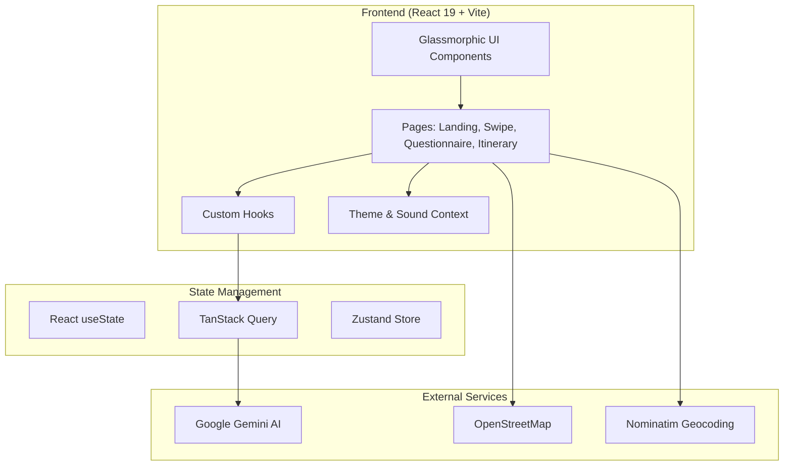

<div align="center">


# Tratlus

### Swipe Your Way to the Perfect Trip

🧭 **AI-Powered Travel Itinerary Planner** — *Discover your travel personality through swipes, then get a personalized day-by-day itinerary*

[](https://react.dev/)
[](https://www.typescriptlang.org/)
[](https://ai.google.dev/)
[](https://tailwindcss.com/)
[](https://web.dev/progressive-web-apps/)

---

**[💼 LinkedIn](https://linkedin.com/in/sahilkamalny)** · **[🌍 Portfolio](https://sahilkamal.dev)** · **[📧 Contact](mailto:sahilkamal.dev@gmail.com)**

**[📖 Architecture](ARCHITECTURE.md)** · **[✨ Features](FEATURES.md)** · **[🛠️ Tech Stack](TECH_STACK.md)**

</div>

---

## 📸 Screenshots

<div align="center">

| Landing Page | Swipe Deck |
|:---:|:---:|
|  | *Screenshot coming soon* |

| Questionnaire | Generated Itinerary |
|:---:|:---:|
| *Screenshot coming soon* | *Screenshot coming soon* |

</div>

---

## ✨ Features

### 🎴 Swipe-Based Preference Discovery
- **Tinder-style swiping** on 50+ curated destinations
- **Like/Dislike/Skip** gestures with smooth animations
- **Intelligent tag weighting** based on swipe patterns
- **Real-time calibration** showing preference progress
- **Quick skip** option to jump to questionnaire

### 📋 Multi-Step Questionnaire
- **Dietary preferences** with allergy tracking
- **Transportation priorities** (speed, comfort, cost, eco-friendly)
- **Accommodation preferences** with star ratings and amenities
- **Budget controls** with sliders and custom inputs
- **Trip duration** and date selection

### 🤖 AI-Powered Itinerary Generation
- **Google Gemini API** integration for intelligent planning
- **Day-by-day breakdown** with timed activities
- **Real-time streaming** responses with animated feedback
- **Smart recommendations** based on travel preferences
- **Cost estimates** for each activity

### 🗺️ Interactive Itinerary Management
- **Drag-and-drop** activity reordering
- **OpenStreetMap integration** for location visualization
- **Activity deletion** with confirmation dialogs
- **Add custom activities** with full details
- **Re-optimize** itinerary with AI

### 📄 Export & Share
- **PDF export** with professional formatting
- **Email integration** for sharing itineraries
- **Calendar integration** for scheduling

### 🌓 Premium UI/UX
- **Glassmorphic design** system with blur effects
- **Dark/Light mode** with system preference detection
- **Smooth animations** throughout
- **Sound effects** with volume controls
- **Mobile-first** responsive design
- **PWA support** for home screen installation

---

## 🏗️ Architecture Overview



### Key Architectural Decisions

| Component | Choice | Rationale |
|-----------|--------|-----------|
| **Frontend** | React 19 + TypeScript | Latest features, type safety, concurrent rendering |
| **Build Tool** | Vite (Rolldown) | Blazing-fast HMR, optimized builds |
| **Styling** | Tailwind CSS 4 | Utility-first, excellent DX, dark mode support |
| **Routing** | TanStack Router | Type-safe routing, file-based routes |
| **Data Fetching** | TanStack Query | Caching, mutations, streaming AI responses |
| **UI Components** | Radix UI + shadcn/ui | Accessible, unstyled primitives |
| **AI** | Google Gemini API | Fast responses, structured JSON output |
| **Maps** | OpenStreetMap + Nominatim | Free, open-source mapping solution |

---

## 📁 Project Structure

```
tratlus/
├── src/
│   ├── components/
│   │   ├── ui/              # shadcn/ui components (49 files)
│   │   ├── pages/           # Page-level components
│   │   │   ├── LoadingPage.tsx
│   │   │   ├── GeneratingPage.tsx
│   │   │   ├── QuestionnairePage.tsx
│   │   │   ├── SwipePage.tsx
│   │   │   └── ItineraryPage.tsx
│   │   ├── landing/         # Landing page component
│   │   └── data/            # Static data resources
│   ├── hooks/
│   │   ├── use-google-gemini-chat.ts  # AI integration hook
│   │   └── use-mobile.ts              # Responsive utilities
│   ├── contexts/
│   │   ├── ThemeContext.tsx           # Dark/light mode
│   │   └── SoundContext.tsx           # Audio controls
│   ├── routes/
│   │   └── index.tsx        # Main app orchestrator (2100+ lines)
│   └── styles.css           # Global styles with CSS variables
├── public/
│   ├── logo.svg             # App logo
│   ├── manifest.json        # PWA manifest
│   └── ...                  # Icons and assets
└── screenshots/             # App screenshots for README
```

---

## 🚀 Getting Started

### Prerequisites

- Node.js 18+
- npm or pnpm

### Installation

```bash
# Clone the repository
git clone https://github.com/sahilkamalny/Tratlus.git
cd Tratlus

# Install dependencies
npm install

# Create .env file with your Gemini API key
echo "VITE_GEMINI_API_KEY=your_api_key_here" > .env

# Start development server
npm run dev
```

### Environment Variables

| Variable | Description |
|----------|-------------|
| `VITE_GEMINI_API_KEY` | Google Gemini API key for AI itinerary generation |

---

## 📊 Tech Stack

| Layer | Technologies |
|-------|-------------|
| **Core** | React 19, TypeScript 5.8, Vite (Rolldown) |
| **Styling** | Tailwind CSS 4, CSS Variables, Glassmorphism |
| **UI Components** | Radix UI, shadcn/ui, Lucide Icons |
| **Routing** | TanStack Router (file-based) |
| **Data** | TanStack Query, Zustand |
| **AI** | Google Gemini API |
| **Maps** | OpenStreetMap, Nominatim |
| **PDF** | jsPDF |
| **Forms** | React Hook Form, Zod |
| **PWA** | vite-plugin-pwa |

---

## 🛠️ Technical Highlights

- **2100+ line orchestrator** managing complex multi-step flow
- **50+ destination cards** with curated travel data
- **5 modular page components** extracted for maintainability
- **Real-time AI streaming** with animated feedback
- **Gesture-based interactions** with touch support
- **Accessibility-first** Radix UI primitives
- **Type-safe** throughout with strict TypeScript

---

## 📱 PWA Features

Tratlus is installable as a Progressive Web App:

- **Home screen installation** on iOS and Android
- **Standalone mode** without browser chrome
- **Portrait-locked** for optimal mobile experience
- **App icons** at multiple resolutions

---

## 📬 Contact

**Sahil Kamal** - Full-Stack Developer

- 🌐 Portfolio: [sahilkamal.dev](https://sahilkamal.dev)
- 💼 LinkedIn: [linkedin.com/in/sahilkamalny](https://linkedin.com/in/sahilkamalny)
- 📧 Email: [sahilkamal.dev@gmail.com](mailto:sahilkamal.dev@gmail.com)

---

<div align="center">

### 📖 Additional Documentation

**[Architecture →](ARCHITECTURE.md)** · **[Features →](FEATURES.md)** · **[Tech Stack →](TECH_STACK.md)**

---

**© 2026 Sahil Kamal**

</div>
